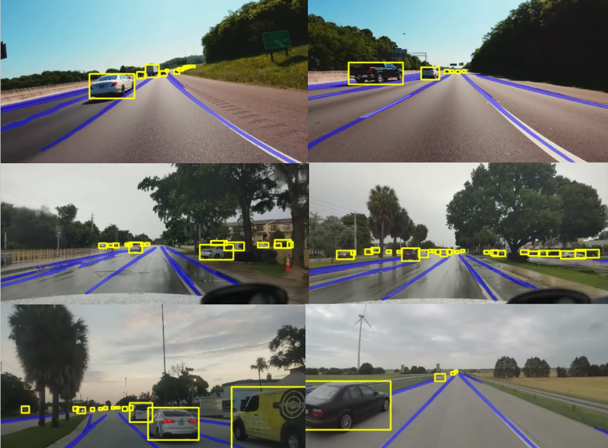
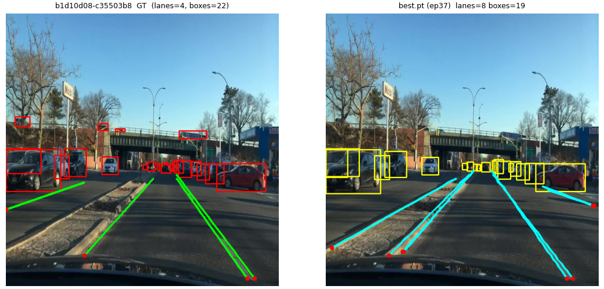
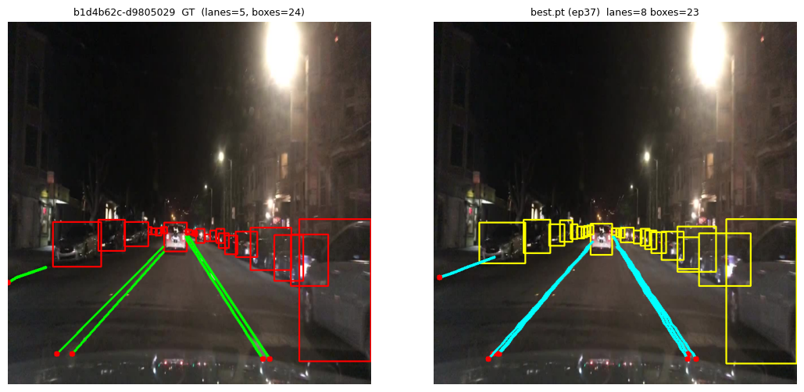
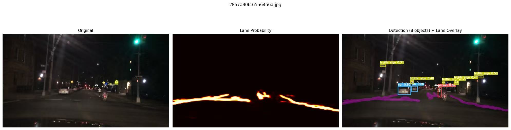
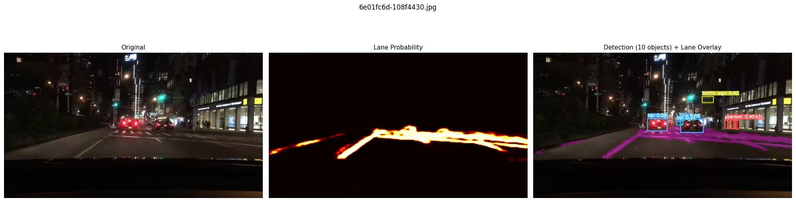

# Unified Panoptic Driving Perception
### EcoCAR Object & Lane Segmentation — EEC 174 Final Project
**Rami Abudamous · Gregory Ceron · Siyun Chen · Tyson-Tien Nguyen**
University of California, Davis

A real-time monocular perception system for the EcoCAR that detects **vehicles** and **lanes**
from a single camera on the [BDD100K](https://bdd-data.berkeley.edu/) dataset, under the
constraint of sharing compute with a separate perception model. The project pursues two
complementary thrusts:

1. **Real-time efficiency** — an optimized YOLOPX panoptic pipeline (vehicle detection + lane mask) rebuilt for low-latency inference.
2. **Lane geometry** — transformer/geometric models that predict lanes as **vectorized polylines** (instance-level, planner-ready) instead of binary masks: **YOLO26 multi-task**, **DETR-GeoLane**, and the main **RMT-PPAD** model.

---

## Results at a glance

| Approach | Task | Key results on BDD100K |
|---|---|---|
| **YOLOPX (optimized)** | Vehicle detection + lane mask | Vehicle **mAP50 82.78%**, **recall 93.05%**; **2.7 → 47.5 FPS (17.6× speedup)**, 170 FPS on an A5000 (FP16) |
| **RMT-PPAD** | Joint detection + **vectorized polyline lanes** | **curve-F1 0.621**, **curveIoU 0.752**, detection **mAP50 0.835** (epoch 37 / 120, still improving) |
| **YOLO26 multi-task** | Vehicle detection + lane mask | detection-only **mAP50 53.7%**, mAP50-95 31.0% |
| **DETR-GeoLane** | Joint detection + polyline lanes | experimental; validated the ordered-point lane formulation |

> The geometric models are reported with **curve-F1 / curveIoU** (a decode-rasterize-match metric)
> rather than pixel-IoU, which saturates near ~0.05 for thin lane lines and is uninformative.

### Published baselines (for reference)
Reported results of the YOLOP family on the BDD100K validation set (from the original papers; speeds on an RTX 3080):

| Model | Det. Recall % | Det. mAP50 % | Drivable mIoU % | Lane Acc. % | Lane IoU % | Params / FPS |
|---|---|---|---|---|---|---|
| YOLOP | 89.2 | 76.5 | 91.5 | 70.5 | 26.2 | 7.9M / 39 |
| HybridNets | 92.8 | 77.3 | 90.5 | 85.4 | 31.6 | 12.8M / 17 |
| YOLOPv2 | 91.1 | 83.4 | 93.2 | 87.3 | 27.2 | — |
| **YOLOPX** *(our baseline)* | **93.7** | **83.3** | **93.2** | **88.6** | **27.2** | 32.9M / 47 |

*Lane columns are pixel-mask Accuracy/IoU; the lane IoU ceiling (~27%) motivated our vectorized approach. FPS is hardware-dependent and not directly comparable to our measurements.*

---

## Approaches

### 1. Real-time YOLOPX panoptic pipeline
YOLOPX is used as the baseline and optimized for deployment: the unneeded drivable-area head is
ablated, and the inference pipeline is rebuilt from the ground up with a multi-threaded
producer-consumer system (NVIDIA DALI) that removes CPU decode/visualization bottlenecks. INT8 /
FP16 / FP32 were compared; FP16 is the chosen balance of speed and accuracy. Code lives in
`lib/`, `tools/`, and `yolop_vehicle_lane/stage1/`.

### 2. RMT-PPAD — vectorized polyline lanes
A ~35.5M-parameter multi-task transformer: a shared **RT-DETR HGNetv2** backbone feeds a detection
decoder (300 queries) and a **CLRNet-style polyline lane head**, coupled by a Gate-Control Adapter.
Each lane is an ordered set of points (start, orientation, length, 72 per-row offsets) — directly
usable by a planner, with no mask post-processing. Trained on the full 70k/10k BDD100K split.
Key engineering results:
- **Custom curve-F1 metric** — un-saturated, geometry-faithful (decode → rasterize → greedy IoU match), replacing the dead pixel-IoU signal.
- **Negative-transfer ablation** (7 techniques) — a training-only auxiliary segmentation head + GCA gate-floor best protect the lane branch (curve-F1 0.211 vs 0.170 baseline) while detection holds.
- **Angle-aware LaneIoU (CLRerNet)** — applied in the **matcher**, not just the loss, is the decisive lever (**+77% curve-F1**); loss-only is counter-productive.
- **Length-shrink fix** — an asymmetric too-short penalty + near-field reweighting recovered mean lane length (0.094 → 0.103) while all metrics kept improving.

Code: `yolop_vehicle_lane/stage2/rmt_ppad_migration/`.

### 3. YOLO26 multi-task
An Ultralytics **YOLO26-S** backbone shared between a 5-class vehicle-detection head and a
transformer lane-segmentation head (160×160 mask). Confirmed shared-backbone multi-task is viable
(detection-only 53.7% mAP50) but the binary-mask lane head inherits the saturation/lack-of-geometry
of the YOLOP family — motivating the geometric approaches above.

### 4. DETR-GeoLane
A dual-path model (ResNet-50 + FPN) with an RT-DETR-style detection decoder and a **MapTR-style**
polyline lane decoder (72-point lanes with per-point visibility). It validated the ordered-point
lane formulation but was hard to optimize from scratch, motivating the pre-trained RMT-PPAD design.
Code: `DETR_GeoLane_pipeline/`.

---

## Qualitative results

**YOLOPX (optimized)** — vehicle detection (boxes) with lane-line and drivable-area segmentation across road and highway scenes.



**RMT-PPAD** — ground truth (left) vs. prediction (right): vehicle boxes + decoded polyline lanes.




**YOLO26 multi-task** — original | lane-probability heatmap | detection boxes + lane overlay.




*More samples in [`images/YOLOPX/`](images/YOLOPX), [`images/RMT-PPAD/`](images/RMT-PPAD), and [`images/yolo26/`](images/yolo26); annotated demo videos in [`inference/video_output/`](inference/video_output).*

---

## Project structure

```
Unified_Segmentation_EEC_174/
├── tools/                       # YOLOPX panoptic scripts: inference.py, train.py, test.py
├── lib/                         # YOLOP/YOLOPX model stack (models, dataset, core, config, utils)
├── inference/video_output/      # annotated demo videos (sim1–sim7)
├── images/                      # qualitative results
│   ├── RMT-PPAD/                #   polyline-lane predictions (GT vs pred)
│   └── yolo26/                  #   multi-task joint-inference panels
├── yolop_vehicle_lane/          # main multi-stage perception project
│   ├── stage1/                  #   YOLOPX vehicle+lane baseline & training
│   ├── stage2/                  #   joint refinement
│   │   └── rmt_ppad_migration/  #     RMT-PPAD (MTDETR + CLR polyline lane head)
│   ├── stage3/                  #   downstream experiments
│   ├── lib/ · docs/             #   shared code & documentation
├── DETR_GeoLane_pipeline/       # DETR + MapTR-style polyline lane experiment (src, configs, notebooks)
├── requirements.txt
└── README.md
```

---

## Installation

**Requirements**
- Windows 11 with a WSL Ubuntu environment (recommended)
- An NVIDIA GPU with nvdec/nvenc support, CUDA 11.x+, and FFmpeg built with nvenc

**Steps**
1. Install Python packages: `pip install -r requirements.txt`
2. Install NVIDIA DALI matched to your CUDA version (e.g. `cuda120` for 12.0). It may need the NVIDIA index:
   ```bash
   pip install --extra-index-url https://developer.download.nvidia.com/compute/redist nvidia-dali-cuda120
   ```

## Usage

1. Create a `weights/` directory and download the [pretrained weights](https://drive.google.com/file/d/1dlwaElu0dQQdoEeJkuP2LKGx1TSCjE-z/view).
2. Create an `inputs/` directory and add your image or video files.
3. Run inference (output defaults to `inference/output/`):
   ```bash
   python3 tools/inference.py --weights weights/epoch-195.pth \
       --source inputs/{video_or_image} --save-dir inference/output \
       --batch-size 16 --device 0
   ```

The geometric models (RMT-PPAD, YOLO26, DETR-GeoLane) are run from their own pipelines —
see the notebooks and READMEs under `yolop_vehicle_lane/stage2/rmt_ppad_migration/` and
`DETR_GeoLane_pipeline/`.

---

## Contributions

- **Rami Abudamous** — model exploration; eliminated CPU bottlenecks with NVIDIA DALI and rebuilt the inference script around a multi-threaded producer-consumer pipeline.
- **Gregory Ceron** — architectural optimization of YOLOPX (drivable-area head ablation) and performance benchmarking (FPS, VRAM).
- **Siyun Chen** — the geometric lane-detection thrust: YOLO26 multi-task and DETR-GeoLane experiments, the **RMT-PPAD** pipeline and its full BDD100K training, the negative-transfer and angle-aware-LaneIoU ablations, the un-saturated curve-F1 metric, and repository maintenance.
- **Tyson-Tien Nguyen** — quantization study (FP16 / FP32 / INT8), including a ReLU retrain for INT8.

## References

1. Wu, D., Liao, M.-W., Zhang, W.-T., et al. **YOLOP: You Only Look Once for Panoptic Driving Perception.** *Machine Intelligence Research*, 19, 550–562, 2022.
2. Zhan, J., Luo, Y., Guo, C., et al. **YOLOPX: Anchor-free multi-task learning network for panoptic driving perception.** *Pattern Recognition*, 148:110152, 2024.
3. Han, C., Zhao, Q., Zhang, S., et al. **YOLOPv2: Better, Faster, Stronger for Panoptic Driving Perception.** arXiv:2208.11434, 2022.
4. Vu, D., Ngo, B., Phan, H. **HybridNets: End-to-End Perception Network.** arXiv:2203.09035, 2022.
5. Zhao, Y., Lv, W., Xu, S., et al. **DETRs Beat YOLOs on Real-time Object Detection (RT-DETR).** *CVPR*, 2024.
6. Zheng, T., Huang, Y., Liu, Y., et al. **CLRNet: Cross Layer Refinement Network for Lane Detection.** *CVPR*, 2022.
7. Honda, H., Uchida, Y. **CLRerNet: Improving Confidence of Lane Detection with LaneIoU.** *WACV*, 2024.
8. Liao, B., Chen, S., Wang, X., et al. **MapTR: Structured Modeling and Learning for Online Vectorized HD Map Construction.** *ICLR*, 2023.
9. **RMT-PPAD: Real-time Multi-task Learning for Panoptic Perception in Autonomous Driving.** arXiv:2508.06529, 2025.
10. Yu, F., Chen, H., Wang, X., et al. **BDD100K: A Diverse Driving Dataset for Heterogeneous Multitask Learning.** *CVPR*, 2020.
11. Jocher, G., Qiu, J., Chaurasia, A. **Ultralytics YOLO.** 2023. <https://github.com/ultralytics/ultralytics>

## Acknowledgements

We thank **Dr. Chen-Nee Chuah** and TAs **Sahishnu Raju**, **Shashank Mahesh**, **Joseph Luna**,
and **Manav Gurnani** for their guidance throughout EEC 174 and the EcoCAR project.
